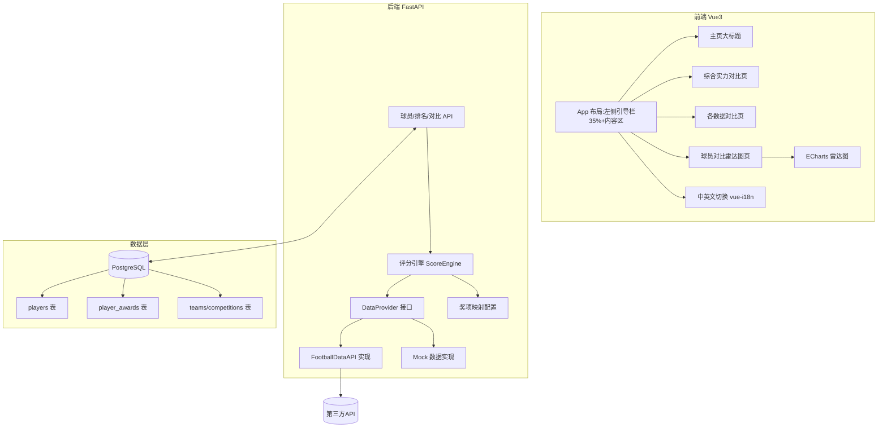

## 用户需求

构建一个名为 **JackeyFootball** 的中英文双语足球职业球员数据对比网站，收录并展示五大联赛最新真实球员数据，按位置分组对比球员实力与各项数据，最终得出综合实力评分与排名。

## 产品概述

网站以左侧 35% 引导栏 + 右侧内容区布局。主页中央展示大标题《JackeyFootball为你展现最完整的球员数据》。左侧三个不同颜色的入口：综合实力对比、各数据对比、球员对比。右上角提供中/英版本切换。所有数据来源合规第三方 API（Football-Data.org 等），无 Key 时回退真实结构的 Mock 数据，缺失字段不填，绝不造假。数据由后端 PostgreSQL 持久化存储。

## 核心功能

- 综合实力对比：按前锋/中场/后卫/门将四个位置分组，各自组内排名，综合评分满分 100（保留一位小数），实时计算展示，逐行排列。
- 各数据对比：球员各项基础数据（进球、助攻、传球、射正、解围、扑救等）按位置逐行排名展示，左侧头像+名字，右侧数据。
- 球员对比：搜索五大联赛球员，最多选 3 人，用雷达图叠加对比 6 个维度（兼顾各位置核心指标）。
- 中英文双语：全站文案支持中文/英文切换。
- 数据权威性：团队冠军（参考 FIFA 赛事权重）、同位置个人荣誉（金球>国际足联/欧足联先生>欧洲金靴>各赛事金靴>雅辛奖，按含金量在同位置内加权）、个人数据、队长影响力、身价年龄、团队实力加成，均参与评分且仅在同位置内比较统治力与巅峰期。

## 技术栈选择

- 前端：Vue 3 + Vite + TypeScript + Element Plus（UI 组件）+ ECharts（雷达图）+ vue-i18n（双语）
- 后端：Python FastAPI + SQLAlchemy 2.0（异步）
- 数据库：PostgreSQL（通过 asyncpg 驱动）
- 数据源：合规第三方 API（Football-Data.org 免费层优先）；无 Key 时回退真实结构的 Mock 数据；奖项表独立维护（半自动整理，保真）
- 工程化：Docker Compose 一键起 PostgreSQL；Pydantic 校验；环境变量管理 Key

## 实现方案

### 策略

按"数据层 → 评分引擎 → API 层 → 前端展示"分层推进。后端负责拉取/存储数据并计算综合评分；前端通过 REST API 取数渲染列表与雷达图。评分引擎按位置分组，采用标准化 + 加权求和，输出 0–100 分（一位小数），同位置内排名，绝不跨位置硬比。

### 关键技术决策

1. **位置分组评分**：每个位置定义独立权重配置（前锋重进球/射正，门将重扑救/零封），保证"同位置比统治力"。权重以 JSON 配置文件维护，便于调参。
2. **数据源可插拔**：定义 `DataProvider` 抽象接口，API 实现与 Mock 实现共用同一套数据模型；通过环境变量 `FOOTBALL_DATA_API_KEY` 有无自动切换，零成本过渡到真实数据。
3. **奖项独立表**：API 一般不含金球/雅辛等奖项，建 `player_awards` 表 + 权威奖项维护脚本（从维基等整理，人工核对保真），评分时按位置映射含金量系数。
4. **雷达图 6 维度**：通用维度（影响力、出勤稳定度）+ 位置核心维度（前锋:进球效率/射正率/关键传球；中场:传球成功率/关键传球/拦截；后卫:解围/拦截/空中对抗；门将:扑救/零封/制空），前端按所选球员位置动态选取 6 维。
5. **双语**：vue-i18n 集中管理文案，语言状态持久化到 localStorage，右上角切换。

### 性能与可靠性

- 球员列表/排名接口使用数据库索引（position, score DESC），避免全表排序瓶颈。
- 评分计算在写入/刷新时一次性批量计算并缓存到 `overall_score` 字段，读取时直接排序，O(1) 查询。
- 第三方 API 调用加超时与重试，失败回退 Mock，记录日志但不污染真实数据。
- 雷达图数据量小（≤3 人×6 维），前端直接计算，无性能问题。

## 实现要点

- 复用 FastAPI 依赖注入管理 DB Session；统一错误响应模型。
- Mock 数据严格遵循真实字段结构（含 `null` 表示缺失），保证切换到真实 API 时前端无需改动。
- 评分权重、赛事权重、奖项含金量系数集中配置，便于后续微调且不改代码。
- 日志仅记录数据拉取成功/失败与评分异常，避免敏感信息。

## 架构设计



## 目录结构

```
JackeyFootball/
├── docker-compose.yml              # [NEW] PostgreSQL 服务编排，一键启动数据库
├── backend/
│   ├── app/
│   │   ├── main.py                # [NEW] FastAPI 入口，注册路由/CORS/生命周期
│   │   ├── config.py              # [NEW] 环境变量(数据库URL/API Key)、权重路径配置
│   │   ├── db.py                  # [NEW] async SQLAlchemy 引擎与 Session 依赖
│   │   ├── models.py              # [NEW] Player/Team/Competition/PlayerAward ORM 模型
│   │   ├── schemas.py             # [NEW] Pydantic 请求/响应模型（含双语字段）
│   │   ├── data/
│   │   │   ├── provider.py        # [NEW] DataProvider 抽象接口
│   │   │   ├── football_data.py   # [NEW] Football-Data.org API 实现（含重试/超时）
│   │   │   ├── mock_provider.py   # [NEW] 真实结构 Mock 数据实现
│   │   │   └── awards_seed.py     # [NEW] 权威奖项维护脚本（金球/雅辛等，保真）
│   │   ├── scoring/
│   │   │   ├── engine.py          # [NEW] 评分引擎：标准化+按位置加权求和
│   │   │   └── weights.json       # [NEW] 赛事权重/位置权重/奖项含金量系数配置
│   │   └── routers/
│   │       ├── players.py         # [NEW] 球员列表/详情/搜索接口
│   │       ├── ranking.py         # [NEW] 按位置综合评分排名接口
│   │       └── compare.py         # [NEW] 球员对比(雷达图维度)接口
│   └── requirements.txt           # [NEW] 依赖声明
└── frontend/
    ├── index.html                 # [NEW] 入口 HTML
    ├── vite.config.ts             # [NEW] Vite + 代理配置(/api -> backend)
    ├── src/
    │   ├── main.ts                # [NEW] 应用初始化，挂载 i18n/ElementPlus/路由
    │   ├── App.vue                # [NEW] 总体布局：左35%引导栏+内容区+右上角语言切换
    │   ├── i18n/
    │   │   └── index.ts           # [NEW] 中英文文案配置
    │   ├── router/index.ts        # [NEW] 路由：主页/综合实力/各数据/球员对比
    │   ├── api/
    │   │   └── client.ts          # [NEW] axios 封装，调用后端 REST API
    │   ├── views/
    │   │   ├── HomeView.vue       # [NEW] 主页大标题
    │   │   ├── PowerRankingView.vue # [NEW] 综合实力对比(按位置分组排名列表)
    │   │   ├── DataRankingView.vue  # [NEW] 各数据对比(逐行排名,左头像右数据)
    │   │   └── CompareView.vue      # [NEW] 球员对比:搜索+最多3人雷达图
    │   └── components/
    │       ├── SideNav.vue        # [NEW] 左侧三色引导栏组件
    │       ├── LangSwitch.vue     # [NEW] 中英文切换组件
    │       └── RadarCompare.vue   # [NEW] ECharts 雷达图叠加对比组件
```

## 关键代码结构

```python
# 评分引擎核心接口（示意签名，不含实现）
class ScoreEngine:
    def compute_overall(self, player: Player, awards: list[PlayerAward],
                        team_strength: float) -> float:
        """按位置分组标准化+加权求和，返回0-100(一位小数)"""
        ...

# 数据提供方抽象
class DataProvider(Protocol):
    async def fetch_players(self, league: str) -> list[Player]:
        """拉取五大联赛球员真实数据，缺失字段留 null"""
        ...
```

## 设计风格

采用现代简洁且具运动科技感的风格（Glassmorphism + 深色基调 + 鲜明强调色）。整体以深蓝/墨黑为背景，左侧 35% 引导栏用三块高饱和彩色卡片（前锋-橙红、中场-蓝青、后卫-墨绿、门将-紫）作为入口，右侧内容区使用半透明玻璃面板承载数据与排名列表。雷达图页以深色画布 + 霓虹描边呈现多球员叠加，视觉层次清晰、动态微交互（hover 高亮、卡片悬浮阴影）。

## 页面规划

1. 主页(Home)：中央大标题《JackeyFootball为你展现最完整的球员数据》，背景渐变光晕，左侧引导栏常驻，右上角语言切换。
2. 综合实力对比(PowerRanking)：按四位置分段，每段内球员逐行排名（左头像+名，右评分条+分数），彩色分段标识。
3. 各数据对比(DataRanking)：选择具体数据指标(进球/助攻/传球等)，按位置逐行排名，左头像右数值条形。
4. 球员对比(Compare)：顶部搜索框(五大联赛球员)，已选球员头像 chips(最多3)，下方 ECharts 雷达图 6 维叠加。

## 单页区块设计

- 顶部导航条：站名左置，语言切换右上角，统一高度与毛玻璃背景。
- 左侧引导栏(SideNav)：占 35% 宽，垂直排列三个彩色入口卡片，选中态加亮边框与位移微动画。
- 内容区：玻璃面板容器，列表行采用头像+名字左、数据/评分右对齐，hover 行高亮。
- 球员对比页：搜索自动补全、已选球员横向 chips、雷达图居中自适应，维度标签双语。

## 可用扩展

### Skill

- **agent-browser**：用于在本地启动后验证前端页面渲染、截图检查布局与双语切换效果。
- 用途：网站搭建完成后自动打开浏览器验证主页、引导栏、雷达图页与各语言切换。
- 预期结果：确认页面布局、三色引导栏、雷达图叠加与中英文切换均正常无报错。