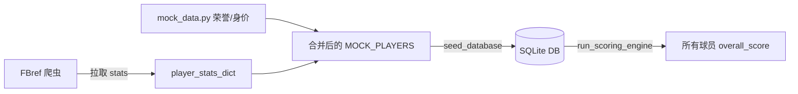

## 用户需求

1. **数据源切换**：从 TheSportsDB 切换到 FBref (StatsBomb)，用爬虫拉取真实的球员统计数据。FBref 免费公开、无需 API Key，提供每 90 分钟的全面进阶数据。
2. **位置筛选**：综合实力排名页新增"全部 / 前锋 / 中场 / 后卫 / 门将"五个位置标签，支持按位置分类查看排名。
3. **保留手动数据**：身价、荣誉、奖项等 FBref 不提供的数据，继续通过 mock_data.py 手动维护。

## 产品概述

JackeyFootball 升级为以 FBref 为数据源的真实球员评分平台，综合实力排名支持按位置分组筛选。

## 核心功能

- FBref 爬虫自动拉取球员本赛季统计（Standard、Shooting、Passing、Defense 等多表），映射到 DB schema
- 综合实力排名页顶部新增位置标签栏，点击切换全量/前锋/中场/后卫/门将视图
- 排名列表随标签切换实时过滤，保持同位置内排名序号
- 队长身份、身价、荣誉/奖项数据仍从种子数据手工维护

## 技术栈

- 爬虫框架：Python + httpx + BeautifulSoup4（异步请求，HTML 解析）
- 后端：FastAPI + SQLAlchemy + SQLite
- 前端（Vue）：Vue 3 + TypeScript + vue-i18n
- 前端（原生 JS）：无构建依赖

## 实现方案

### 架构策略

不改变现有数据管线：爬虫拉取数据写入 mock_data 格式的 dict，再由 seed_database() 统一入库。这样无需改动 ORM、评分引擎、API 层。



### FBref 爬虫设计

新建 `backend/app/services/fbref_scraper.py`，复用 thesportsdb_client.py 的异步架构（httpx AsyncClient、重试、限流间隔）。

**字段映射**（FBref 列名 → DB 字段）：

| FBref Stat | DB 字段 | 说明 |
| --- | --- | --- |
| Goals | goals | 联赛进球 |
| Assists | assists | 联赛助攻 |
| Shots Total | shots_total | 射门总数 |
| Shots on Target | shots_on_target | 射正 |
| Pass Completion % | pass_accuracy | 传球成功率 |
| Key Passes (Passing表) | key_passes | 关键传球 |
| Tackles (Defense表) | tackles | 抢断 |
| Interceptions | interceptions | 拦截 |
| Clearances | clearances | 解围 |
| Blocks | blocks | 封堵 |
| Saves (Goalkeeping表) | saves | 扑救 |
| Clean Sheets | clean_sheets | 零封 |
| Goals Against | goals_conceded | 失球 |
| Successful Take-Ons | dribbles_completed | 成功过人 |
| Aerials Won | aerial_duels_won | 空中对抗 |


**爬取策略**：每球员访问其 FBref 球员页面（URL 从预设 ID 列表构造），依次解析 Standard、Shooting、Passing、Defense、Goalkeeping、Misc 六张表，按列名映射。请求间隔 2.5 秒，失败重试 2 次。

### 位置筛选 UI

PowerRankingView.vue 修改：

- 新增 `activePos` ref（默认 `'all'`）
- 标题下方插入位置标签栏，复用 `POSITION_META` 的颜色和中英文名
- `ranked` computed 改为先按 `activePos` 过滤再排序
- `onMounted` 中 `getPlayers()` 改为传入 `activePos` 参数（当非 all 时）

```ts
const activePos = ref<string>('all')
const filtered = computed(() =>
  activePos.value === 'all'
    ? players.value
    : players.value.filter(p => p.position === activePos.value)
)
const ranked = computed(() =>
  [...filtered.value].sort((a, b) => b.overall_score - a.overall_score)
)
```

### 文件变更清单

| 文件 | 操作 | 说明 |
| --- | --- | --- |
| `backend/app/services/fbref_scraper.py` | 新建 | FBref 爬虫核心模块 |
| `backend/app/services/mock_data.py` | 修改 | 年薪+身价+荣誉+队长修正，SEASON 改为 2025/2026 |
| `frontend/src/views/PowerRankingView.vue` | 修改 | 新增位置标签栏 + 过滤逻辑 |
| `frontend/src/constants.ts` | 修改 | NATION_ZH_MAP 补 `'The Netherlands': '荷兰'` |
| `backend/app/static/app.js` | 修改 | 新增 NATION_ZH_MAP 国籍翻译 |
| `backend/jackeyfootball.db` | 删除重建 | 清空后重新种子 |