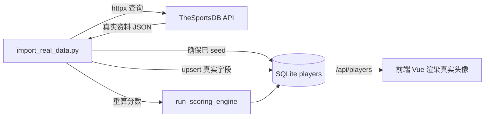

## 用户需求

将现有网站从"示例数据"切换为接入真实第三方足球数据，获取免费且无需注册的球员真实信息，至少包含：球员头像、现效力俱乐部、所属国家队（及国籍、年龄、位置等可公开字段）。

## 产品概述

通过 TheSportsDB 免费数据源（默认测试 Key 即可调用，无需注册）拉取真实球员资料，用一次性导入脚本把真实头像、俱乐部、国家队等字段写入现有数据库，替换原先的示例占位数据；评分引擎所依赖的身价、赛季统计、荣誉等指标仍沿用精选值，保证排名功能稳定可用。前端已具备远程头像渲染与加载失败兜底，无需改动即可展示真实头像。

## 核心功能

- 接入 TheSportsDB REST API，按球员英文名查询真实资料（头像 strThumb/strCutout、现俱乐部 strTeam、国籍 strNationality、出生日期 dateBorn、位置 strPosition）
- 字段归一化映射：头像 URL、俱乐部、国家队/国籍、由出生日期计算年龄、位置枚举映射（forward/midfielder/defender/goalkeeper）、英文名
- 一次性导入脚本：复用现有精选指标（身价/统计/荣誉），仅在已有球员记录上补全真实字段（upsert，幂等可重跑），导入后重算综合实力评分
- API Key 配置化（默认 "3"，可通过 .env 的 THESPORTSDB_API_KEY 覆盖个人 Key）
- 提供 TheSportsDB 免费层使用与（可选）Patreon 升级获取个人 Key 的注册指引

## 技术栈

- 后端：FastAPI + SQLAlchemy 2.0 + httpx 0.25（均已纳入 requirements.txt）
- 数据源：TheSportsDB API v1（`https://www.thesportsdb.com/api/v1/json/{key}/searchplayers.php?p={name}`），免费层默认 Key "3" 可直接调用，无需注册
- 数据库：现有 SQLite（jackeyfootball.db），Player 模型已含 `image_url`/`current_club`/`national_team`/`nationality`/`age`/`position` 字段
- 前端：Vue3（无需改动，已用 `:src="p.image_url"` 渲染远程头像并带 `@error` 首字母兜底）

## 实现方案

### 总体策略

新增轻量客户端封装 TheSportsDB 查询与字段映射；新增导入脚本，在确保数据库已 seed（复用 mock 的评分指标）的前提下，遍历现有球员按 `name_en` 调用 API 补全真实字段并 upsert，最后重跑评分引擎。前端零改动即可展示真实头像。

### 关键技术决策

1. **只补全"可免费获取"的真实字段，不替换评分指标**：TheSportsDB 免费层不含身价、详细统计、荣誉。若强行替换会破坏评分引擎。因此保留 `mock_data.py` 的身价/统计/荣誉作为精选指标，仅用 API 覆盖 `image_url`/`current_club`/`nationality`/`national_team`/`age`/`position`，兼顾真实性与评分稳定性。
2. **复用 MOCK_PLAYERS 而非新建清单**：导入脚本直接遍历数据库中已 seed 的球员（即原精选球星），按 `name_en` 查询，避免重复维护名单、并天然复用其指标与 stats/honors/awards 关系。
3. **upsert 而非清空重建**：按 `name_en` 匹配更新，脚本可重复安全运行（幂等），且 API 失败时不破坏已有数据。
4. **Key 配置化 + 默认值**：`config.py` 增加 `thesportsdb_api_key: str = "3"`，无需注册即可运行；个人 Key 通过 `.env` 覆盖，便于后续提升额度。

### 性能与可靠性

- httpx 设置 `timeout` 与简单重试（最多 2 次），请求间加 ~300ms 间隔避免免费层限流。
- 单个球员查询异常被捕获并记录日志，跳过该球员保留原 mock 值，保证整体导入不中断。
- 头像为空/缺失时返回空串，前端 `@error` 自动显示首字母色块兜底，避免破图。
- 导入为一次性离线脚本，不影响 `main.py` 启动时的 mock seed 兜底逻辑。

## 实现注意事项

- 复用现有 `SessionLocal`、`Base`、`get_db` 与 `run_scoring_engine()`，不要复制评分逻辑。
- 位置映射需覆盖 TheSportsDB 常见写法：`Forward`/`Foward`→forward、`Midfield`/`Midfielder`→midfielder、`Defender`→defender、`Goalkeeper`/`Keeper`→goalkeeper，未匹配时保留原值并记录警告。
- 头像优先取 `strCutout`（透明切割图），为空则取 `strThumb`，再为空返回 `""`。
- 年龄由 `dateBorn`（YYYY-MM-DD）按当前日期计算，解析失败保留原值。
- 日志复用 Python 标准 `logging`，仅记录成功/跳过/失败计数，避免打印大体积响应体。

## 架构设计

数据流：



导入脚本与运行时 `main.py` 解耦：`main.py` 的 `_ensure_seed` 仍用 mock 作为 DB 为空兜底；真实数据由手动运行导入脚本写入，互不影响。

## 目录结构

```
backend/
├── app/
│   ├── config.py                      # [MODIFY] 增加 thesportsdb_api_key 配置项（默认 "3"），支持从 .env 读取
│   └── services/
│       └── thesportsdb_client.py      # [NEW] TheSportsDB 客户端：封装 searchplayers 查询、字段归一化映射、超时/重试/限流
├── .env.example                       # [NEW] 说明 THESPORTSDB_API_KEY 配置及 TheSportsDB 免费层/Patreon 升级注册指引
└── import_real_data.py                # [NEW] 一次性导入脚本：确保 seed → 遍历球员调 API 补全真实字段 → upsert → 重跑评分引擎
```

## 关键代码结构

```python
# backend/app/services/thesportsdb_client.py
async def search_player(name_en: str) -> dict:
    """查询 TheSportsDB 并返回归一化球员资料。
    返回字段：name_en, image_url, current_club, nationality,
    national_team, age, position；查询失败或字段缺失时返回空值字典。
    """

# backend/app/config.py
class Settings(BaseSettings):
    thesportsdb_api_key: str = "3"   # 免费测试 Key；个人 Key 写入 .env 覆盖
```